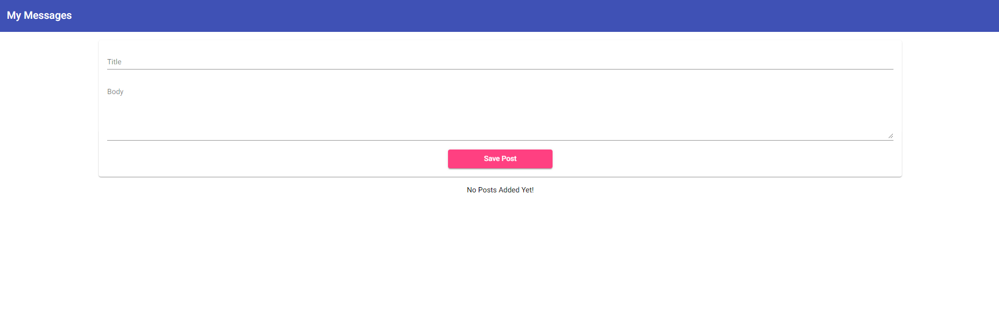
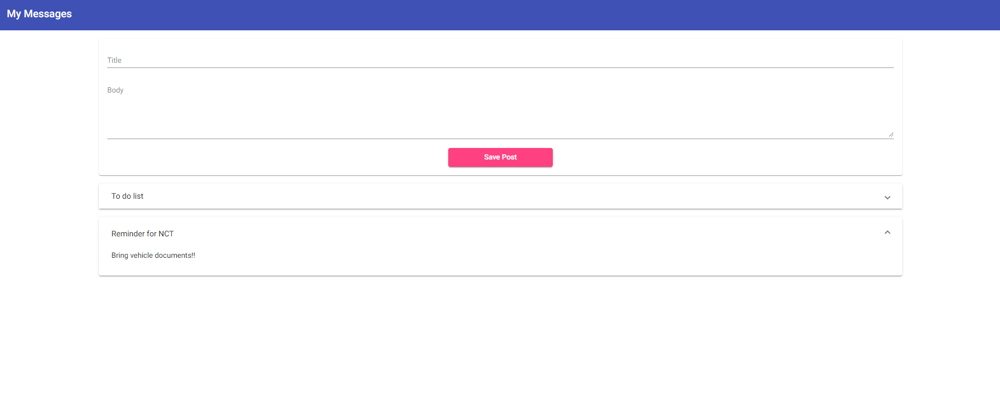

# SimpleUI in Angular 13

Simple UI to demonstrate

- EventEmitter - @angular/core
- Output - @angular/core
- Input - @angular/core
- Built-in structural directives (ngFor)
- FormsModule - @angular/forms
- angular material - @angular/material
- event binding
- property binding

# Hosted on Netlify

<!-- rocket emoji -->

🚀 [Live Demo](https://stirring-tapioca-ce8072.netlify.app/)

 

# Packages

- Angular Meterial 13.3.9

# Commands used to generate this project

- `ng new simple-ui --no-strict --style=css`
- `ng generate component header`
- `ng generate component posts/post-create`
- `ng generate component posts/post-list`
- `ng add @angular/material`

---

This project was generated with [Angular CLI](https://github.com/angular/angular-cli) version 13.1.2.

## Development server

Run `ng serve` for a dev server. Navigate to `http://localhost:4200/`. The app will automatically reload if you change any of the source files.

## Code scaffolding

Run `ng generate component component-name` to generate a new component. You can also use `ng generate directive|pipe|service|class|guard|interface|enum|module`.

## Build

Run `ng build` to build the project. The build artifacts will be stored in the `dist/` directory.

## Running unit tests

Run `ng test` to execute the unit tests via [Karma](https://karma-runner.github.io).

## Running end-to-end tests

Run `ng e2e` to execute the end-to-end tests via a platform of your choice. To use this command, you need to first add a package that implements end-to-end testing capabilities.

## Further help

To get more help on the Angular CLI use `ng help` or go check out the [Angular CLI Overview and Command Reference](https://angular.io/cli) page.
